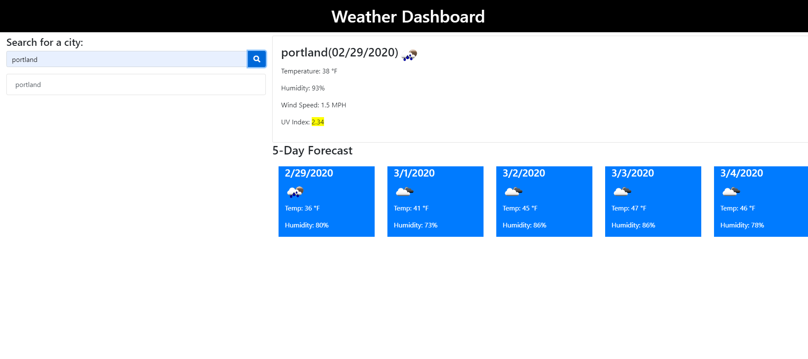

# Weather Dashboard
In this homework assignment we were asked to build a weather dashboard that will use the OpenWeather API to retrieve weather data for cities and use local storage to store any persistant data. When you search for a city, then you are presented with current and future conditions for that city and that city is added to the search history. We needed to make several different AJAX calls to retrieve current weather, UV index, and a 5 day forecast. 

## Challenges
I found that trying to understand the response that the api sends back to be most challenging. Understanding how to find the date in a sea of feedback and then trying to learn how to transcribe that into a readable date was difficult. I'm also not completely familiar with local storage yet, so it took a bit of trial and error to find what would work best. 

## Deployed Project

[Weather Dashboard](https://tristinbarnett.github.io/Weather-Dashboard/)

